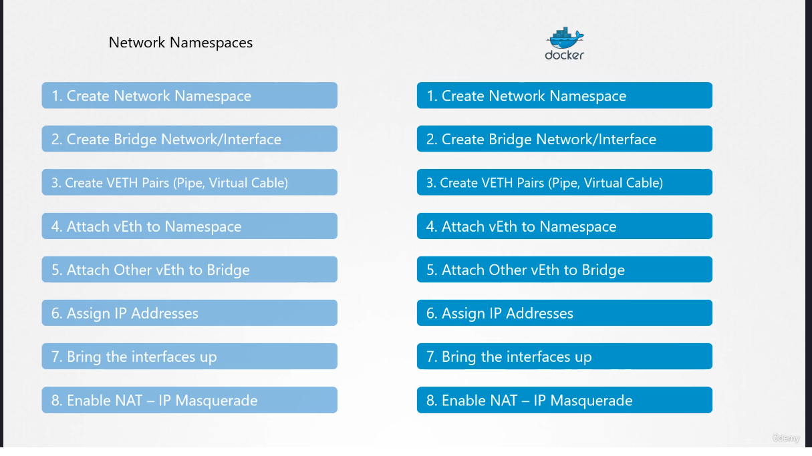
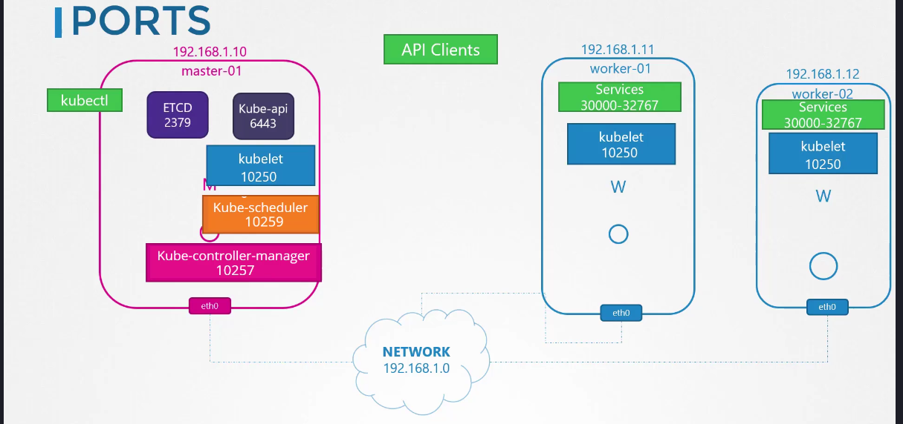
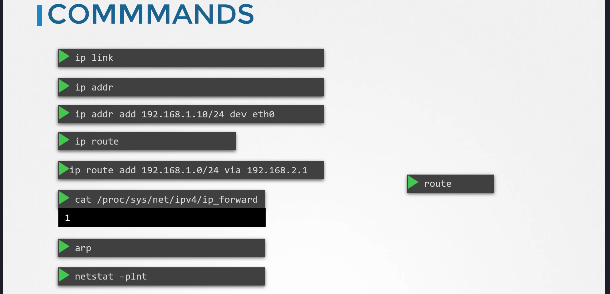
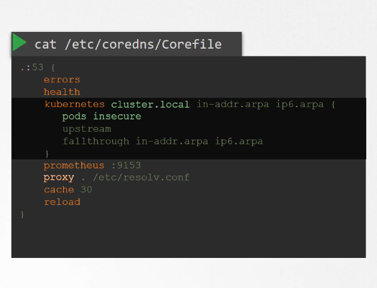
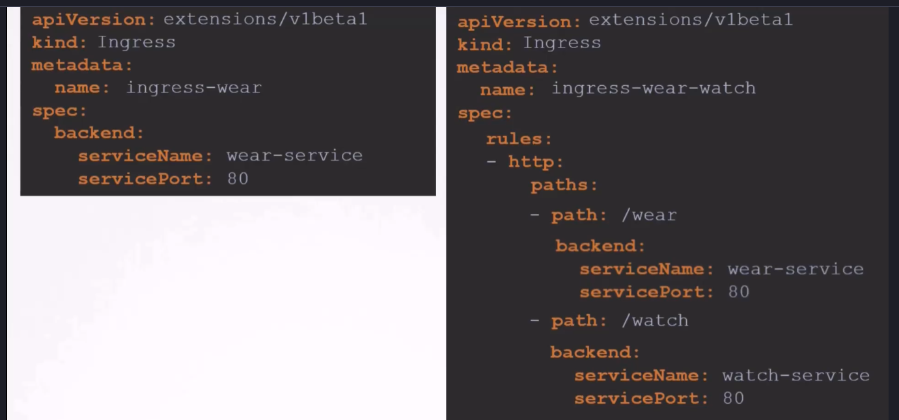
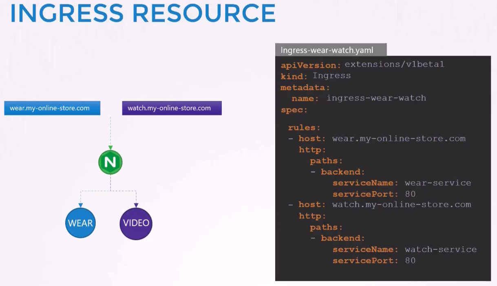
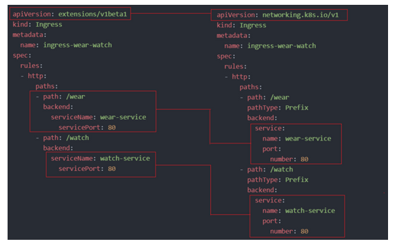
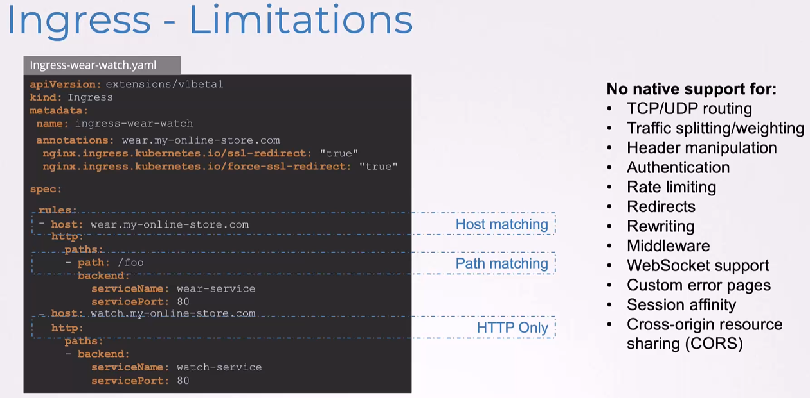
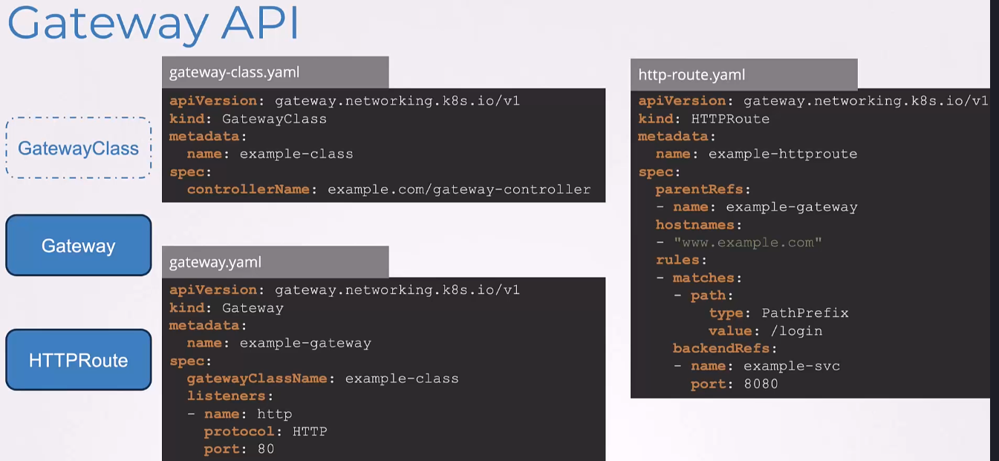
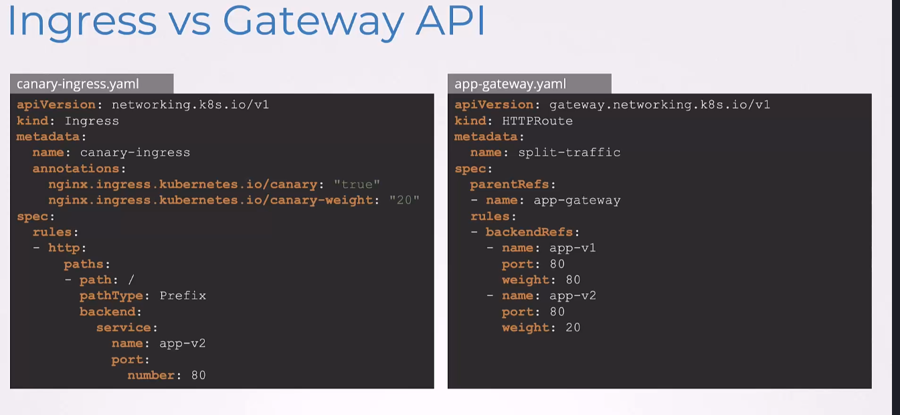

# Docker Networking

Docker network is built around a network named
- `bridge` in the docker mechanism ( via `kubectl network ls` )
- `docker0` on the host

The docker0 is stored in a network namespace ( just like in the basics we saw earlier )

The bridge is seen like an interface on the host. It can be seen by `ip addr docker0 | grep -i inet`

Whenever a container is created, Docker creates a network namespace for it.

```
### List network namespaces on the host
ip netsh

...
b3165**** reserved name for docker namespaces
```

So when Docker creates a container : 
- it creates the container
- it creates a virtual ethernet interface veth***** just like we did for our interface veth*_ns earlier
- it attach the virtual interface to the bridge docker0

Starting now the container is technically "pingable" through the bridge.


Starting now the container will get an IP (we will see later how the IP is given), for example `17.17.0.3`

and it's reachable **from the host** : 

```
curl https://172.17.0.3:80
Welcome to nginx !
```

but it's still not available from outside the host with a `no route to host` error.


## CNI



TODO : See chapter 222 for full explanation, it's important for the certification


## Cluster Networking

A cluster is made of unique : 
- a master node
- one or several worker nodes
- a master node can work as worker too



`+ port 2380 INPUT/OUPUT pour ETCD entre les master nodes s'ils existent`



https://kubernetes.io/docs/concepts/cluster-administration/addons/

https://kubernetes.io/docs/concepts/cluster-administration/networking/#how-to-implement-the-kubernetes-networking-model

NOTE : most of CNI / Network addons

Most of CNI are only two yamls that you deploy on the cluster, but it can be more difficult

## Practice

https://uklabs.kodekloud.com/topic/practice-test-explore-environment-2/


kubectl describe node controlplane | grep -i internalip
eth0@if12145:
02:f9:5a:32:ae:6d

We use Containerd as our container runtime. What is the interface/bridge created by Containerd on the controlplane node?

```
ip route sh
default via 169.254.1.1 dev eth0<
netstat -netupal | grep -i listen | grep -i kube-scheduler
netstat -netupal | grep -i established | grep -i etcd
```

## Pod Networking

As we saw, pods have IPs in network namespaces
On the node level, a bridge exists to allow communication between each pod.
A good idea is to allow all pods and bridges to share the same network allowing bridge of each node to communicate with each other, specially bridges.

### CNI in Kubernetes

**CNI = Container Network Interface :** a standard that Kubernetes uses to `manage networking` for containers.
- calico 
- flannel
- weave Net
- cilium

DO NOT CONFUSE WITH ContainerD or CRI-o which are runtime environments meaning that they are made to run a pod or a container.

```
Note CNI Weave

Important Update: -

Before going to the CNI weave lecture, we have an update for the Weave Net installation link. They have announced the end of service for Weave Cloud.

To know more about this, read the blog from the link below: -

https://www.weave.works/blog/weave-cloud-end-of-service

As an impact, the old weave net installation link won’t work anymore: -

kubectl apply -f "https://cloud.weave.works/k8s/net?k8s-version=$(kubectl version | base64 | tr -d '\n')"

Instead of that, use the below latest link to install the weave net: -

kubectl apply -f https://github.com/weaveworks/weave/releases/download/v2.8.1/weave-daemonset-k8s.yaml

Reference links: -

    https://www.weave.works/docs/net/latest/kubernetes/kube-addon/#-installation

    https://github.com/weaveworks/weave/releases
```


### CNI Weave

https://kubernetes.io/docs/tasks/administer-cluster/network-policy-provider/weave-network-policy/

### Practice

https://uklabs.kodekloud.com/topic/practice-test-cni-weave-2/

ps -aux | grep -i kubelet | grep -i runtime

Location of storage containing CNI libs on controlplane
/opt/cni/bin


Identify which of the below plugins is available in the list of available CNI plugins on this host?
ls /opt/cni/bin # A directory == a plugin

Identity which plugin is enabled on the cluster
ls /etc/cni/net.d/ 

**Note :** All binaries contained in /etc/cni/net.d will be run by kubelet after a container and its associated namespace are created.

### Practice 2 - Deploy network solution

Weave Net is a tool that helps Kubernetes enforce NetworkPolicy, controlling which pods can talk to each other securely.
Weave Net can manage networking for pods too.
It's an alternative to Calico to manage network policies, and it's absolutely not related to flannel (flannel does not support netpols)

If you need just NetworkPolicies, Calico is often preferred for performance. If you want simple setup + encryption, Weave Net is a great choice! 

https://uklabs.kodekloud.com/topic/practice-test-deploy-network-solution-2/

kubectl apply -f https://github.com/weaveworks/weave/releases/download/v2.8.1/weave-daemon
set-k8s.yaml


### IP Address Management (IPAM) - Veawe

- how IP bridges get IP subnets 
- How pods get IPs
- how to avoid ip duplications

To see which CNI is used :

cd /etc/cni/net.d/net-script.conf

By default for example Weave uses 10.32.0.0/12 as subnet to allow IPs

### Practice networking weave

https://uklabs.kodekloud.com/topic/practice-test-networking-weave-2/

To see which networking solution is used
cat /etc/cni/net.d/10-weave.conflist


number of weave agent = `kubectl get pods -A | grep -i weave` (it's a daemonset, so one on every node)

Name of brige/network interface created by weave == `ip addr sh` on one of a node

Pod IP subnet range ==> Nothing identified, so it's 10.32.x.x

```
ip route sh
default via 172.25.0.1 dev eth1
```

Know default gateway of a platform :

```
kubectl run busybox --image=busybox sleep 10000
kubectl exec -it busybox -- /bin/sh
ip route sh
   defaut via MYGATEWAY
```

## Service Networking

A service is accessible from all pods on the cluster, no matter the node.

- clusterIP : have its own IP and is only accessible within the cluster
- NodePort : have its own IP and is accessible outside the cluster

Define the IP range in case of clusterIP subnet

`kube-api-server --service-cluster-ip-range <ipsubnet>`

Keep in mind that kube-proxy will be in charge of open flows between nodes (iptables etc...)

`cat /var/log/kube-proxy.log` on every node.


## Practice

https://uklabs.kodekloud.com/topic/practice-test-service-networking-2/


## DNS in Kubernetes

- dig
- dns

Nothing exotic here.

Each pod has its dns definition, and will communicate with core dns that will act as a dns nameserver inside the cluster



## Practice

https://uklabs.kodekloud.com/topic/practice-test-coredns-in-kubernetes-2/

kubectl  get pods -A
kubectl get services -n kube-system

## Ingress

Application load balancer -> Ingress ------------------> service ------------------------> pod
/apparel (outside of k8s) -> /apparel (inside of k8s) -> allow to resend on port of pod -> micro-system

Usually ingresses are agglomerated over ONE ingress that will support the access IP with tools like `ingress controller`.


https://kubernetes.io/docs/concepts/services-networking/ingress/







```
kubectl create ingress <ingress-name> --rule="host/path=service:port"
Example:

kubectl create ingress ingress-test --rule="wear.my-online-store.com/wear*=wear-service:80"
```

https://kubernetes.io/docs/reference/generated/kubectl/kubectl-commands#-em-ingress-em-
https://kubernetes.io/docs/concepts/services-networking/ingress
https://kubernetes.io/docs/concepts/services-networking/ingress/#path-types

## Practice 

https://uklabs.kodekloud.com/topic/practice-test-cka-ingress-networking-1-2/

If only this following ingress on a app, if URL does not exists -> page 404
```
apiVersion: networking.k8s.io/v1
kind: Ingress
metadata:
  annotations:
    nginx.ingress.kubernetes.io/rewrite-target: /
    nginx.ingress.kubernetes.io/ssl-redirect: "false"
  creationTimestamp: "2025-04-02T19:40:13Z"
  generation: 2
  name: ingress-wear-watch
  namespace: app-space
  resourceVersion: "1734"
  uid: 0f7c8ee8-8ea6-433b-a0e1-7c199af61657
spec:
  rules:
  - http:
      paths:
      - backend:
          service:
            name: wear-service
            port:
              number: 8080
        path: /wear
        pathType: Prefix
      - backend:
          service:
            name: video-service
            port:
              number: 8080
        path: /stream
        pathType: Prefix
status:
  loadBalancer:
    ingress:
    - ip: 172.20.114.61
```


And now a lazy way, if you have an ingress controller, to have maaaany ingresses and have to keep all ingresses in ONE central entry point
to accumulate it with the ingress right before. 

```
apiVersion: networking.k8s.io/v1
kind: Ingress
metadata:
  annotations:
    nginx.ingress.kubernetes.io/rewrite-target: /
    nginx.ingress.kubernetes.io/ssl-redirect: "false"
  creationTimestamp: "2025-04-02T19:40:13Z"
  generation: 4
  name: pay-ingress
  namespace: critical-space
spec:
  rules:
  - http:
      paths:
      - backend:
          service:
            name: pay-service
            port:
              number: 8080
        path: /pay
        pathType: Prefix
```


## Practice 

https://uklabs.kodekloud.com/topic/practice-test-cka-ingress-networking-2-2/

kubectl create sa ingress-nginx -n ingress-nginx
kubectl create sa ingress-nginx-admission -n ingress-nginx


TODO : Chapter 250 this practice to be redone

## GATEWAY API

It's the new way of defining Ingress -> soon to replace ingress

/!\ TODO : LEARN IT 

https://kubernetes.io/docs/concepts/services-networking/gateway/

You have to know how to translate an ingress to a gateway API



Of course we have solutions for each of those limitations BUT lets do it a little better 

## Comparison: Ingress vs Gateway API

| Feature               | Ingress            | Gateway API        |
|----------------------|-----------------|------------------|
| **Traffic Types**    | Only HTTP/S      | HTTP, HTTPS, TCP, UDP, gRPC |
| **Routing Flexibility** | Basic (host/path-based) | Advanced (header, method, weight-based, etc.) |
| **Multi-Tenant Support** | Limited | Strong multi-tenancy |
| **Advanced Traffic Control** | Limited | Native retries, timeouts, mirroring, etc. |
| **Controller Consistency** | Varies by implementation | Standardized across implementations |
| **API Modularity** | Single object | Multiple objects (Gateway, Route, etc.) |

A gateway is a different way to represent data contained into all ingresses.

Until now you have only one object to do everything : 
- You have many ingresses containing informations about hosts, URL, and services
- You have ingress controller which serve as enter points, and dispatch all requests to the different ingresses
- You need many annotations to create many stuff
- You are only limited to HTTP(S)

With this new approach of gateway, you can define MUCH MORE flows.


With gateways it works over three different objects :


- GatewayClass : to represent a controller, it points on a controller, it's cluster-wide resource

A gatewayclass defines how a gateway is implemented by a controller

Some Common controller Name Values

|**Provider**	| controllerName|
|-----------------------|------------|
|**NGINX**	| "k8s.io/nginx"|
|**Istio**	| "istio.io/gateway-controller"|
|**Traefik**	| "traefik.io/gateway-controller"|
|**AWS Load Balancer**	| "alb.ingress.k8s.aws/gateway"|

For example for AWS you will deploy the gatewayclass `AWS Load Balancer`

https://kubernetes.io/docs/concepts/services-networking/gateway/#api-kind-gateway-class

```
apiVersion: gateway.networking.k8s.io/v1
kind: GatewayClass
metadata:
  name: example-class
spec:
  controllerName: example.com/gateway-controller
```


- Gateway : a way to represent a listener, an entrypoint "I listen in http, port 80", there is a reference to gatewayclass, it's namespace scoped

https://kubernetes.io/docs/concepts/services-networking/gateway/#api-kind-gateway

```
apiVersion: gateway.networking.k8s.io/v1
kind: Gateway
metadata:
  name: example-gateway
spec:
  gatewayClassName: example-class
  listeners:
  - name: http
    protocol: HTTP
    port: 80
```


- HTTPRoute : to represent url contents, parentRefs is pointing on a gateway, and backendref is pointing on a service, it's namespace scoped

https://kubernetes.io/docs/concepts/services-networking/gateway/#api-kind-httproute

```
apiVersion: gateway.networking.k8s.io/v1
kind: HTTPRoute
metadata:
  name: example-httproute
spec:
  parentRefs:
  - name: example-gateway
  hostnames:
  - "www.example.com"
  rules:
  - matches:
    - path:
        type: PathPrefix
        value: /login
    backendRefs:
    - name: example-svc
      port: 8080
```






So let's guess that you are on AWS and you want two ALB:
- one ALB for inner access
- one ALB for public access

You will implement :
- one gatewayclass for AWS ALB
- two gateways, one for each of your ALB
- one HTTPRoute for each of your former ingress that will point on your services

You need to deploy a controller to make it work : https://www.eksworkshop.com/docs/networking/vpc-lattice/setup (do not pay attention about lattice for this specific suject) 


## Practice API Gateway

https://udemy.com/course/certified-kubernetes-administrator-with-practice-tests/learn/lecture/48755139#overview


AllowedRoutes parameter in a gateway is meant to define which namespace is allowed to attach routes to a gateway

```
apiVersion: gateway.networking.k8s.io/v1
kind: Gateway
metadata:
  name: shared-gateway
  namespace: ingress-team
spec:
  gatewayClassName: nginx-gateway-class
  listeners:
  - protocol: HTTP
    port: 80
    allowedRoutes:
      namespaces:
        from: All  # Allows routes from ANY namespace
```


ICMP are not supported by httproutes


```
kubectl patch svc nginx-gateway -n nginx-gateway --type='json' -p='[
  {"op": "replace", "path": "/spec/ports/0/nodePort", "value": 30080},
  {"op": "replace", "path": "/spec/ports/1/nodePort", "value": 30081}
]'
```

kubectl explain gateway.spec.listeners.allowedRoutes | more

```
apiVersion: gateway.networking.k8s.io/v1
kind: Gateway
metadata:
  name: nginx-gateway
  namespace: nginx-gateway
spec:
  gatewayClassName: nginx
  listeners:
  - name: http
    protocol: HTTP
    port: 80
    allowedRoutes:
      namespaces:
        from: All
```

Of course a gateway can have agglomerate httproutes from other namespaces, here a route from another the default namespace

```
apiVersion: gateway.networking.k8s.io/v1
kind: HTTPRoute
metadata:
  name: frontend-route
spec:
  parentRefs:
  - name: nginx-gateway
    namespace: nginx-gateway
  rules:
  - matches:
    - path:
        type: PathPrefix
        value: /
    backendRefs:
    - name: frontend-svc
      port: 80
```
